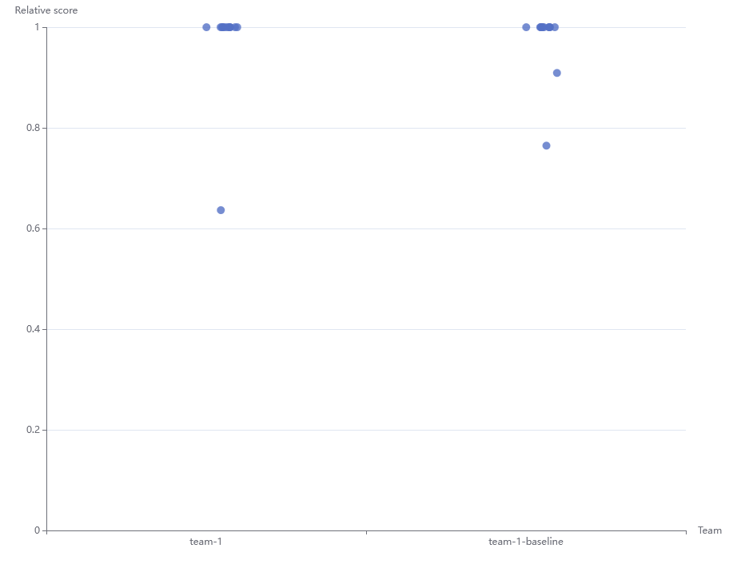

# GDA - Testing

Testing framework for testing different versions of optimizers.

.



## Test Instances

All the test instances are in the [./graphs](./graphs) folder.

A description of them can be found in [GRAPHS.md](./GRAPHS.md)

## Test Runner

Then run `cargo run graphs --save 'path/to/your/optimizer'`

If your optimizer requires a complex command, make sure to use quotes `cargo run graphs --save 'complex command --with --args`.

This generates a `stats/optimizer-name.csv` file with some statistics, and `save`s all the generated graphs to the `./saved` folder

`cargo run leaderboard` takes those files and generates a leaderboard out of them!

## Protocol for optimizers

So you're writing an optimizer and want to use the automated testing infrastructure?

Just add a main loop like this to your program
```rs
// Print the name of
// - your solver
// - a version number
// - and what parameters its being executed with
println!("START Team1-v4-spring-only");
while(true) {
    // Request an instance
    println!("GRAPH");

    // An entire graph on one line
    let json_graph = stdin.read_line(); 
    
    // Check for stdin being closed. This is programming language specific.
    if json_graph.len() == 0 { 
        break;
    }

    println!(json_graph_optimized);
}
```

Your optimizer first announces its name. That name will be used for the output `.csv` file.

Then, it requests a JSON graph. It'll be formatted on a single line as an input.
Your optimizer can now run its algorithm(s) on the graph. Please use a timeout here, you don't want the testing tool to hang forever.

Finally, it should print the entire resulting graph, formatted on a single line.
Remember to have a line break at the end.

The testing tool will *validate* that your output graph is valid, and will also compute the crossings.
This can be extremely helpful for spotting bugs.

Optimizers can print debug information to `stderr`. This will show up in the console.
I recommend printing a lot of useful info there.

For your convenience, any print statements other than `START` and `GRAPH` and `{ some json }` won't have an effect.

## Protips!

If your optimizer crashes partways, do not worry. You can resume it at any point by using the `skip-to` flag.

`cargo run graphs --skip-to complete_bipartite_graph/100_50.json 'path/to/your/optimizer'`

We encourage you to send us your results! Send us a GitHub pull request, and we'll add them.

## Resources

- https://github.com/jw1912/SPRT


